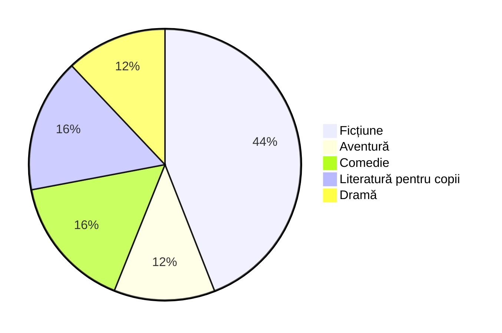

# Proiect de Grup - „Cărțile noastre”
### Membrii echipei: . . .
### Planul meu de lectură: 
| Septembrie                                        | Octombrie                           | Noiembrie                             | 
| ------------------------------------------------- | ----------------------------------- | ------------------------------------- | 
| „O vară cu Isidor” de Veronica D. Niculescu       | „Două loturi” de Ion Luca Caragiale | „Bacalaureat” de Ion Luca Caragiale   | 
| „Un pedagog de școală nouă” de Ion Luca Caragiale | „Inspectiune” de Vlad Zografi       | „Emil și detectivii” de Erich Kästner | 

| Decembrie                          | Ianuarie                                | Februarie                            |
| ---------------------------------- | --------------------------------------- | ------------------------------------ |
| „Cireșarii” de Constantin Chiriță  | „La Medeleni” de Ionel Teodoreanu       | „Povestiri” de Ion Luca Caragiale    |
| „Moara cu noroc” de Ioan Slavici   | „Dumbrava minunată” de Mihail Sadoveanu | „Cartea cu jucării” de Tudor Arghezi |

| Martie                              | Aprilie                                                    | Mai                            |
| ----------------------------------- | ---------------------------------------------------------- | ------------------------------ |
| „Zborul” de Sorin Titel             | „Romanul adolescentului miop” de Mircea Eliade             | „Maitreyi” de Mircea Eliade    |
| „Hanul Ancuței” de Mihail Sadoveanu | „Concert din muzică de Bach” de Hortensia Papadat-Bengescu | „Ion” de Liviu Rebreanu        |

### Categoriile Mele:

### Calcule
| Gen Literar             | Număr de Cărți | Procentaj        | Reprezentare       |
| ----------------------- | -------------- | ---------------- | ------------------ |
| Ficțiune                | 11             | 11*100/24 = 45.8 | 45.8*3.6 = 164.9°  |
| Aventură                | 3              | 3*100/24  = 12.5 | 12.5*3.6 = 45°     |
| Comedie                 | 4              | 4*100/24  = 16.6 | 16.6*3.6 = 59.7°   |
| Literatură pentru copii | 4              | 4*100/24  = 16.6 | 16.6*3.6 = 59.7°   |
| Dramă                   | 3              | 3*100/24  = 12.5 | 12.5*3.6 = 45°     |
