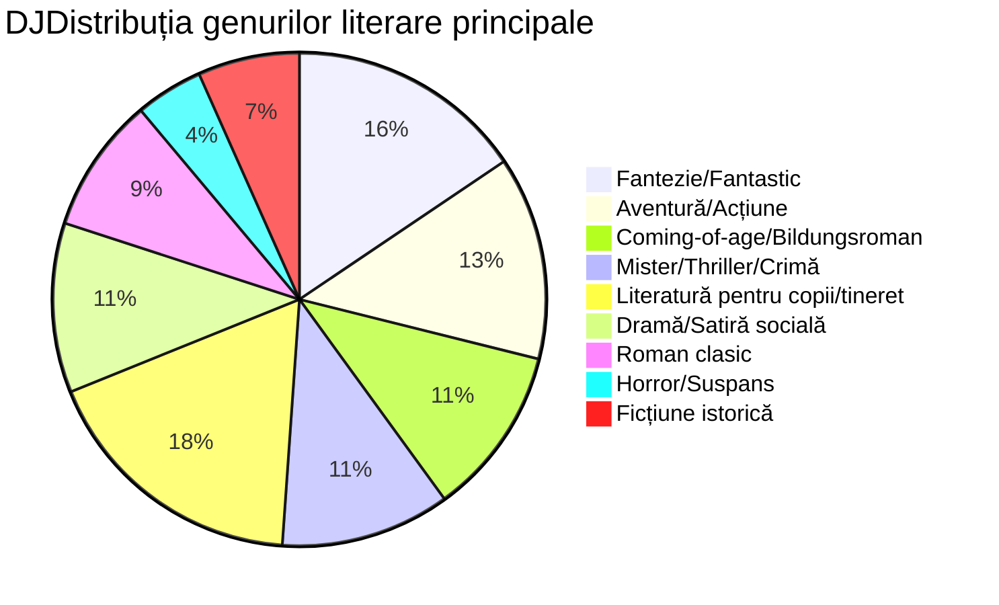

# Proiect de Grup - „Cărțile noastre”
### Membrii echipei: Bulea Alexandru, Erdic Sofia, Ravac Anastasia, Râșcanu David
### Planurile de lectură:
Format: "[nume carte]" de [autor carte] - [genul literar al carții]

"Minunea" de R.J. Palacio - Coming-of-age / Acceptare de sine
"Cei trei mușchetari" de Alexandre Dumas - Aventură istorică
"Cum am supraviețuit clasei a 8-a" de Robert Esten - Comedie pentru adolescenți
"Copacul cu 13 etaje" de Andy Griffiths - Fantezie pentru copii
"Prinț și cerșetor" de Mark Twain - Aventură istorică / Schimb de identități
"Eroina Clementina" de Sara Pennypacker - Ficțiune pentru copii / Umor
"Poveste de Crăciun" de Charles Dickens - Fantezie / Morală
"Pânza Charlottei" de E.B. White - Ficțiune pentru copii / Prietenie
"Aventurile lui Sherlock Holmes" de Sir Arthur Conan Doyle - Mister / Detectiv
"Singur pe lume" de Hector Malot - Aventură / Coming-of-age

"Harry Potter și Piatra Filosofală", de J.K Rowling - Fantastic
"Singur pe lume", de Hector Malot - Roman
"Cireșarii", de Constantin Chiriță - Roman
"Harry Potter și Ordinul Pheonix", de J.K Rowling - Fantastic
"O vară cu Isidor", de Veronica D. Niculescu - Roman
"Carrie" de Stephen King - Roman epistolar, Horror
"Prințul nemilos" de Holly Black - Fantastic
"Pacienta tăcută" de Alex Michaelides - Thriller

"Diavolul din orașul alb" de Erik Larson - Crimă adevărată / Istorie
"10 negri mititei" de Agatha Christie - Mister / Thriller psihologic
"Sfârșitul șoaptelor" de Ruta Sepetys - Ficțiune istorică / Coming-of-age
"O familie de mincinoși" de E. Lockhart - Thriller psihologic / Mister pentru tineri adulți
"Aurit" de Marissa Meyer - Fantezie / Repovestire de basm

"O vară cu Isidor" de Veronica D. Niculescu - Aventură pentru copii
"Un pedagog de școală nouă" de Ion Luca Caragiale - Satiră socială
"Două loturi" de Ion Luca Caragiale - Comedie de moravuri
"Inspectiune" de Vlad Zografi - Dramă socială
"Bacalaureat" de Ion Luca Caragiale - Satiră educațională
"Moara cu noroc" de Ioan Slavici - Dramă psihologică
"La Medeleni" de Ionel Teodoreanu - Coming-of-age
"Romanul adolescentului miop" de Mircea Eliade - Bildungsroman

### Categorii:

// Din cauza unui bug în librăria folosită mai sus, prefixul `DJ` este necesar pentru afișarea corectă a tilului, scuzele mele pentru oricine va fi nevoit să editeze acest fișier în mod direct. 

### Statistici:
### Total cărți: 31
### Genuri:
Coming-of-age / Bildungsroman: 4
Aventură (inclusiv istorică): 4
Fantezie / Fantastic: 5
Ficțiune pentru copii: 3
Mister / Detectiv: 3
Thriller psihologic: 2
Roman: 4
Comedie / Umor: 2
Crimă adevărată: 1
Ficțiune istorică: 1
Horror: 1
Satiră (socială, educațională): 3
Dramă (socială, psihologică): 2
Repovestire de basm: 1
Roman epistolar: 1
Acceptare de sine: 1
Morală: 1
Prietenie: 1
