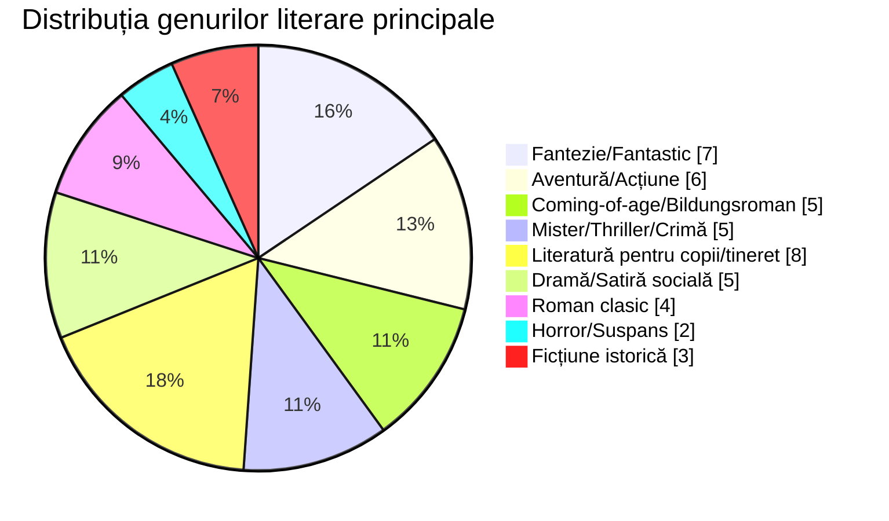

# Proiect de Grup - „Cărțile noastre”
### Membrii echipei: Bulea Alexandru, Erdic Sofia, Ravac Anastasia, Râșcanu David
### Planurile de lectură:
Format: "[nume carte]" de [autor carte] - [genul literar al carții]
| Titlu                               | Autor                    | Gen                                  |
|-------------------------------------|--------------------------|--------------------------------------|
| Prinț și cerșetor                   | Mark Twain               | Aventură istorică / Schimb de identități |
| Eroina Clementina                   | Sara Pennypacker         | Ficțiune pentru copii / Umor         |
| Poveste de Crăciun                  | Charles Dickens          | Fantezie / Morală                    |
| Pânza Charlottei                    | E.B. White               | Ficțiune pentru copii / Prietenie    |
| Aventurile lui Sherlock Holmes      | Sir Arthur Conan Doyle   | Mister / Detectiv                    |
| Singur pe lume                      | Hector Malot             | Aventură / Coming-of-age             |

| Titlu                               | Autor                    | Gen                                  |
|-------------------------------------|--------------------------|--------------------------------------|
| Harry Potter și Piatra Filosofală   | J.K Rowling              | Fantastic                            |
| Singur pe lume                      | Hector Malot             | Roman                                |
| Cireșarii                           | Constantin Chiriță       | Roman                                |
| Harry Potter și Ordinul Pheonix     | J.K Rowling              | Fantastic                            |
| O vară cu Isidor                    | Veronica D. Niculescu    | Roman                                |
| Carrie                              | Stephen King             | Roman epistolar, Horror              |
| Prințul nemilos                     | Holly Black              | Fantastic                            |
| Pacienta tăcută                     | Alex Michaelides         | Thriller                             |

| Titlu                               | Autor                    | Gen                                  |
|-------------------------------------|--------------------------|--------------------------------------|
| Diavolul din orașul alb             | Erik Larson              | Crimă adevărată / Istorie            |
| 10 negri mititei                    | Agatha Christie          | Mister / Thriller psihologic         |
| Sfârșitul șoaptelor                 | Ruta Sepetys             | Ficțiune istorică / Coming-of-age    |
| O familie de mincinoși              | E. Lockhart              | Thriller psihologic / Mister pentru tineri adulți |
| Aurit                               | Marissa Meyer            | Fantezie / Repovestire de basm       |

| Titlu                               | Autor                    | Gen                                  |
|-------------------------------------|--------------------------|--------------------------------------|
| O vară cu Isidor                    | Veronica D. Niculescu    | Aventură pentru copii                |
| Un pedagog de școală nouă           | Ion Luca Caragiale       | Satiră socială                       |
| Două loturi                         | Ion Luca Caragiale       | Comedie de moravuri                  |
| Inspectiune                         | Vlad Zografi             | Dramă socială                        |
| Bacalaureat                         | Ion Luca Caragiale       | Satiră educațională                  |
| Moara cu noroc                      | Ioan Slavici             | Dramă psihologică                    |
| La Medeleni                         | Ionel Teodoreanu         | Coming-of-age                        |
| Romanul adolescentului miop         | Mircea Eliade            | Bildungsroman                        |

### Categorii:

### Statistici:
### Total cărți: 31
### Genuri:
- Coming-of-age / Bildungsroman: 4 
-  (inclusiv istorică): 4 
- Fantezie / Fantastic: 5 
- Ficțiune pentru copii: 3 
- Mister / Detectiv: 3 
- Thriller psihologic: 2 
- Roman: 4 
- Comedie / Umor: 2 
- Crimă adevărată: 1 
- Ficțiune istorică: 1 
- Horror: 1 
- Satiră (socială, educațională): 3 
- Dramă (socială, psihologică): 2 
- Repovestire de basm: 1 
- Roman epistolar: 1 
- Acceptare de sine: 1 
- Morală: 1 
- Prietenie: 1 
