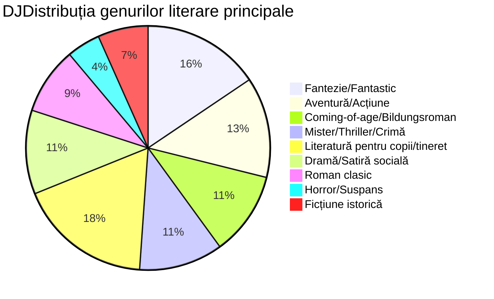

# Proiect de Grup - „Cărțile noastre”
### Membrii echipei: Bulea Alexandru, Erdic Sofia, Ravac Anastasia, Râșcanu David
### Planurile de lectură:
Format: "[nume carte]" de [autor carte] - [genul literar al carții]

"Minunea" de R.J. Palacio - Coming-of-age / Acceptare de sine   
"Cei trei mușchetari" de Alexandre Dumas - Aventură istorică   
"Cum am supraviețuit clasei a 8-a" de Robert Esten - Comedie pentru adolescenți   
"Copacul cu 13 etaje" de Andy Griffiths - Fantezie pentru copii   
"Prinț și cerșetor" de Mark Twain - Aventură istorică / Schimb de identități   
"Eroina Clementina" de Sara Pennypacker - Ficțiune pentru copii / Umor   
"Poveste de Crăciun" de Charles Dickens - Fantezie / Morală   
"Pânza Charlottei" de E.B. White - Ficțiune pentru copii / Prietenie   
"Aventurile lui Sherlock Holmes" de Sir Arthur Conan Doyle - Mister / Detectiv   
"Singur pe lume" de Hector Malot - Aventură / Coming-of-age   

"Harry Potter și Piatra Filosofală", de J.K Rowling - Fantastic   
"Singur pe lume", de Hector Malot - Roman   
"Cireșarii", de Constantin Chiriță - Roman   
"Harry Potter și Ordinul Pheonix", de J.K Rowling - Fantastic   
"O vară cu Isidor", de Veronica D. Niculescu - Roman   
"Carrie" de Stephen King - Roman epistolar, Horror   
"Prințul nemilos" de Holly Black - Fantastic   
"Pacienta tăcută" de Alex Michaelides - Thriller   

"Diavolul din orașul alb" de Erik Larson - Crimă adevărată / Istorie   
"10 negri mititei" de Agatha Christie - Mister / Thriller psihologic   
"Sfârșitul șoaptelor" de Ruta Sepetys - Ficțiune istorică / Coming-of-age   
"O familie de mincinoși" de E. Lockhart - Thriller psihologic / Mister pentru tineri adulți   
"Aurit" de Marissa Meyer - Fantezie / Repovestire de basm   

"O vară cu Isidor" de Veronica D. Niculescu - Aventură pentru copii   
"Un pedagog de școală nouă" de Ion Luca Caragiale - Satiră socială   
"Două loturi" de Ion Luca Caragiale - Comedie de moravuri   
"Inspectiune" de Vlad Zografi - Dramă socială   
"Bacalaureat" de Ion Luca Caragiale - Satiră educațională   
"Moara cu noroc" de Ioan Slavici - Dramă psihologică   
"La Medeleni" de Ionel Teodoreanu - Coming-of-age   
"Romanul adolescentului miop" de Mircea Eliade - Bildungsroman   

### Categorii:

// Din cauza unui bug în librăria folosită mai sus, prefixul `DJ` este necesar pentru afișarea corectă a tilului, scuzele mele pentru oricine va fi nevoit să editeze acest fișier în mod direct. 

### Statistici:
#### Total cărți: 31
#### Genuri:
Coming-of-age / Bildungsroman: 4   
Aventură (inclusiv istorică): 4   
Fantezie / Fantastic: 5   
Ficțiune pentru copii: 3   
Mister / Detectiv: 3   
Thriller psihologic: 2   
Roman: 4   
Comedie / Umor: 2   
Crimă adevărată: 1   
Ficțiune istorică: 1   
Horror: 1   
Satiră (socială, educațională): 3   
Dramă (socială, psihologică): 2   
Repovestire de basm: 1   
Roman epistolar: 1   
Acceptare de sine: 1   
Morală: 1   
Prietenie: 1
